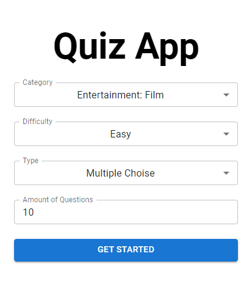
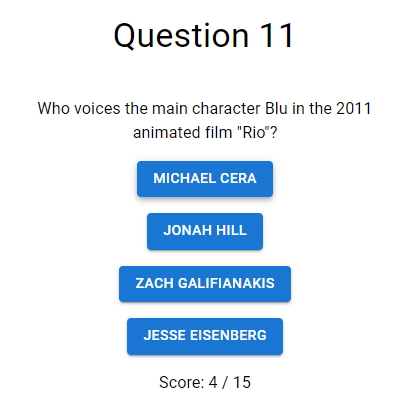
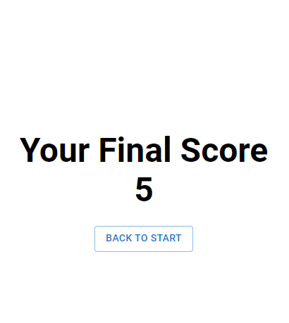

<h1 align="center">Quiz App</h1>

  <a href="#-technologies">Technologies</a>&nbsp;&nbsp;&nbsp;|&nbsp;&nbsp;&nbsp;
  <a href="#-project">Project</a>&nbsp;&nbsp;&nbsp;|&nbsp;&nbsp;&nbsp;
  <a href="#-user-interface">Design</a>&nbsp;&nbsp;&nbsp;

## 🚀 Technologies

## 💻 Project
Web Application develop to provide a quiz game interface using [Open Trivia Database](https://opentdb.com/). This project was guided and developed with the help of instructional [Youtube Tutorial](https://www.youtube.com/watch?v=6LROvk5d8H8).

## 🔖 Design

### 1. Setup Page
   
      

        
      

     
### 2. Question Page
   
      

        
      
  
   
### 3. Final Score Page
   
      

        
      

---